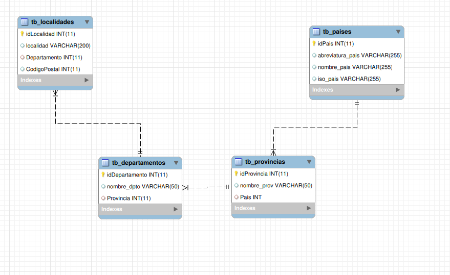

# pais-provincia-departamento-localidad-laRioja
SQL con tabla paises, provincias,departamentos y localidades(la Rioja) - Argentina

# Modelo simple, luego ire agregando el resto de localidades y departamentos
